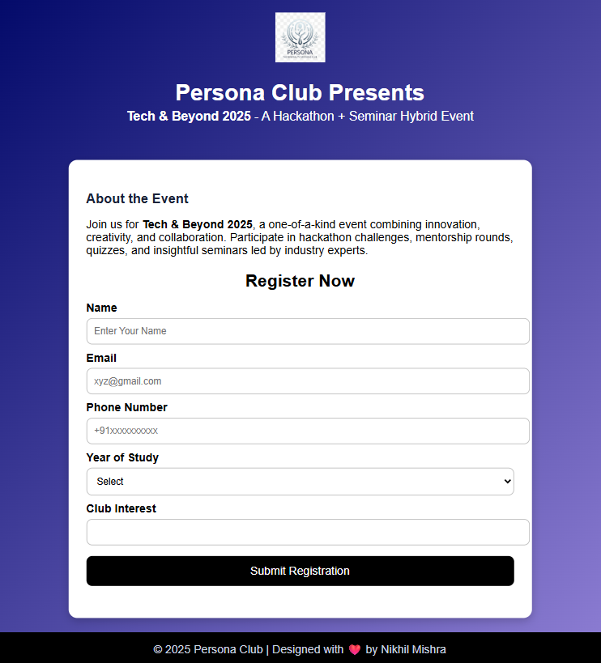

# Persona Club – Tech Task Submission  
Hey there, I'm **Nikhil Mishra** and this is my task for the Persona recruitment.** 

---

## 📌 Project Overview
This is my little project for **Persona Club recruitment tasks**.  
The objective is to build a simple, clean, and responsive **Event Registration Page** using **HTML & CSS**.  

It demonstrates:
- HTML structure for an event landing page.
- External CSS for styling and design.
- User-friendly registration form.

---

## 🛠️ Made With
- **HTML5** – structure of the page  
- **CSS3** – styling and layout  

---

## 📂 Files
- `index.html` → Main HTML file containing structure of the event registration page.  
- `style.css` → External stylesheet that controls the design (colors, spacing, fonts, etc.).  
- `.png` & `.jpg` files for logo, icon.
---

## 🎯 Features
- A little **Description** about the Event in the top of container.
- Responsive **registration form** with fields:
  - Name
  - Email
  - Phone Number
  - Year of Study
  - Club Interest
- Clean, card-like **container layout**.  
- Gradient **blue and purple background** for a modern look.  
- Interactive **orange hover effect** on the submit button.  
- Footer section with credits.  

---

## 🚀 How to Run
1. Download files (`index.html`, `style.css` & `.png` `.jpg`).  
2. Keep them in the same folder.  
3. Open `index.html` in any browser.  
4. You will see the **event landing + registration form**.  

---

## 📸 Preview

---

## 📖 Notes
- The CSS is kept separate for cleaner code management.  
- The page is lightweight, simple, and loads fast.

---

✨ **Designed with ❤️ by Nikhil Mishra**